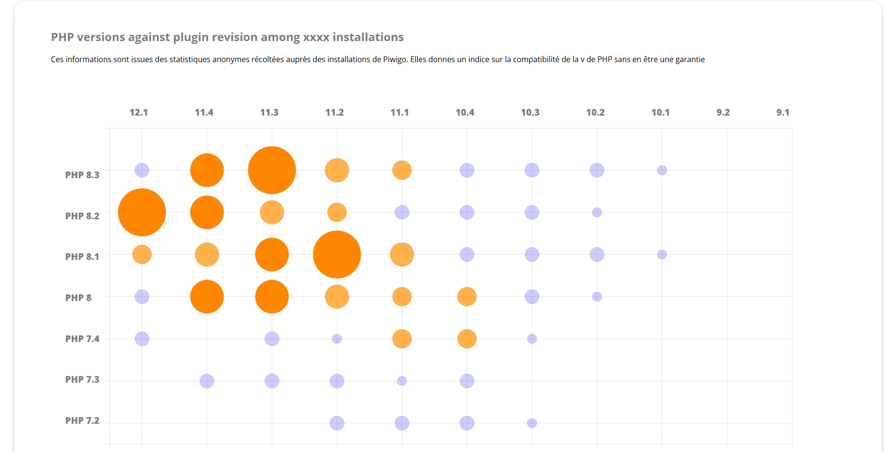
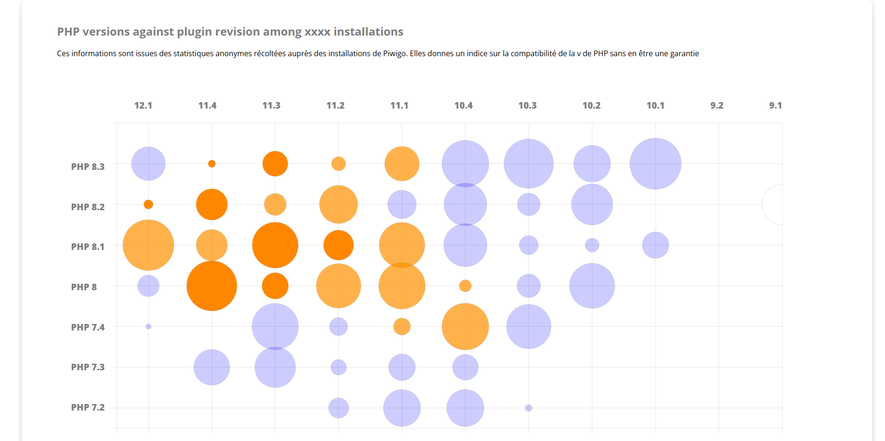
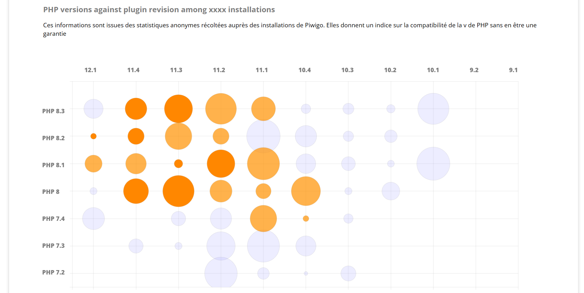
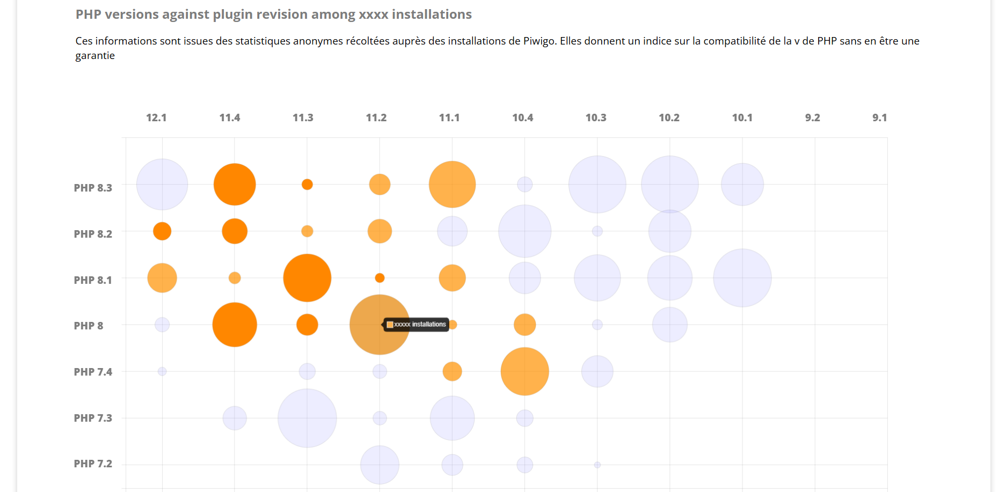

# Piwigo_exercice1

Réalisé par Estevan ROLLAND le 20/02/2026  
Aucune IAg n'a été utilisée lors du projet

## Exercice d'entretient technique chez Piwigo

### Consigne :

Implémenter en HTML/CSS/JS la maquette : 
  

Dans un premier temps, hardcoder des valeurs pour la taille des points orange. Dans un second temps, faire varier aléatoirement la valeur de chaque point au chargement de la page. Le rendu se fait via un repo Github.

### Ressources utilisées :
La librairie JavaScript Chart.js : https://www.chartjs.org/docs/latest/

### Résultats obtenus :

#### Points de taille fixe, valeurs hardcodées
  

#### Points de taille aléatoire, change à chaque reload de la page
 
 
 